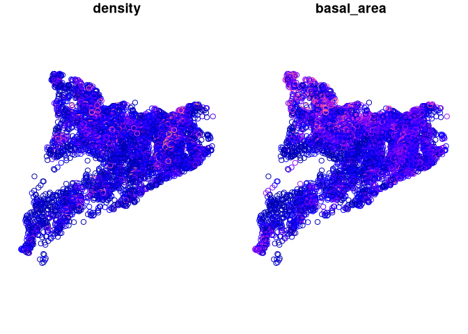
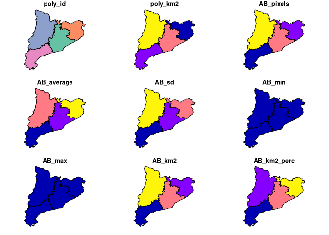

<!-- README.md is generated from README.Rmd. Please edit that file -->

# lfcdata

<!-- badges: start -->

[](https://github.com/MalditoBarbudo/lfcdata/actions)
<!-- badges: end -->

The goal of `lfcdata` R package is to provide access to the [Laboratori
Forestal Català](http://laboratoriforestal.creaf.cat/) public
databases.

## Installation

You can install the released version of lfcdata from
[GitHub](https://github.com/MalditoBarbudo/lfcdata) with:

``` r
# install.packages("remotes")
remotes::install_github("MalditoBarbudo/lfcdata", ref = "master", build_vignettes = TRUE)
```

And the development version from
[GitHub](https://github.com/MalditoBarbudo/lfcdata/tree/staging) with:

``` r
# install.packages("remotes")
remotes::install_github("MalditoBarbudo/lfcdata", ref = "staging", build_vignettes = TRUE)
```

## Databases

A quick glance on the current availbale databases. See
`vignette(package = 'lfcdata')` to get a more detailed explanation of
each db as well as their tables and variables.

### Spanish National Forest Inventory (NFI) data for Catalonia

``` r
library(lfcdata)
library(dplyr)
#> 
#> Attaching package: 'dplyr'
#> The following objects are masked from 'package:stats':
#> 
#>     filter, lag
#> The following objects are masked from 'package:base':
#> 
#>     intersect, setdiff, setequal, union
nfidb <- nfi()
nfidb
#>  Access to the Spanish National Forest Inventory data for Catalonia.
#>  laboratoriforestal.creaf.cat
#> 
#>  Use nfi_get_data to access the tables.
#>  Use nfi_avail_tables to know which tables are available.
#>  Use nfi_describe_var to get the information available on the variables.
#>  See vignette('tables_and_variables', package = 'lfcdata') to learn more about the tables and variables.
nfidb %>%
  nfi_get_data('plot_nfi_4_results', spatial = TRUE) %>%
  select(geometry, density, basal_area) %>%
  plot()
#> Querying table from LFC database, this can take a while...
#> Done
#> Querying table from LFC database, this can take a while...
#> Done
```



### Allometries

``` r
allometriesdb <- allometries()
allometriesdb
#>  Access to the LFC allometries database.
#>  laboratoriforestal.creaf.cat
#> 
#>  Use allometries_get_data to access the tables.
#>  Use allometries_calculate to calculate new values based on the allometries.
#>  Use allometries_describe_var to get the information available on the variables.
#>  See vignette('tables_and_variables', package = 'lfcdata') to learn more about the tables and variables.
allometriesdb %>%
  allometries_get_data('allometries')
#> Querying table from LFC database, this can take a while...
#> Done
#> # A tibble: 9,157 x 22
#>    allometry_id allometry_level allometry_level… spatial_level spatial_level_n…
#>    <chr>        <chr>           <chr>            <chr>         <chr>           
#>  1 BRH_1427     organ           branch           county        Alt Camp        
#>  2 BH_287       organ           branch           county        Alt Camp        
#>  3 Ht_3211      tree            tree             county        Alt Camp        
#>  4 DC_2036      tree            tree             county        Alt Camp        
#>  5 GC_2609      tree            tree             county        Alt Camp        
#>  6 BH_288       organ           branch           county        Alt Camp        
#>  7 BRH_1428     tree            tree             county        Alt Camp        
#>  8 BH_289       tree            tree             county        Alt Camp        
#>  9 Ht_3212      tree            tree             county        Alt Camp        
#> 10 DC_2037      tree            tree             county        Alt Camp        
#> # … with 9,147 more rows, and 17 more variables: functional_group_level <chr>,
#> #   functional_group_level_name <chr>, dependent_var <chr>,
#> #   independent_var_1 <chr>, independent_var_2 <chr>, independent_var_3 <chr>,
#> #   equation <chr>, param_a <dbl>, param_b <dbl>, param_c <dbl>, param_d <dbl>,
#> #   special_param <chr>, cubication_shape <chr>, source <chr>, n_obs <dbl>,
#> #   r_sqr <dbl>, see <dbl>
```

### LiDAR eco-physiological data for Catalonia

``` r
lidardb <- lidar()
lidardb
#>  Access to the LiDAR database.
#>  laboratoriforestal.creaf.cat
#> 
#>  Use lidar_get_data to access the administrative divisions aggregated data.
#>  Use lidar_get_lowres_raster to access access the low resolution rasters (400x400m).
#>  Use lidar_avail_tables to know which tables are available.
#>  Use lidar_describe_var to get the information available on the variables.
#>  Use lidar_clip_and_stats to summarise the raw raster (20x20m) by provided polygons.
#>  Use lidar_point_value to extract values from the raw raster (20x20m).
#>  See vignette('tables_and_variables', package = 'lfcdata') to learn more about the tables and variables.
lidardb %>%
  lidar_get_data('lidar_provinces', 'AB') %>%
  plot()
```


